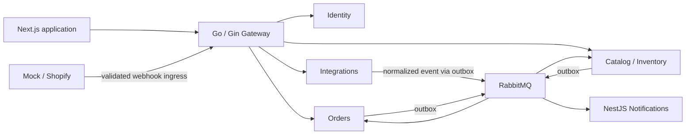

# Intended system boundaries

The diagram describes the target business flow. Phase 00 provides the minimal web
application, Gateway liveness and local PostgreSQL/RabbitMQ/Redis infrastructure.
The web page makes no API calls yet; business services and the arrows below remain
planned.

Each stateful service has owner-restricted PostgreSQL storage. Redis is temporary
infrastructure. Standard public API traffic enters through Gateway; internal endpoints
remain private. See [system architecture](../architecture/system.md).
